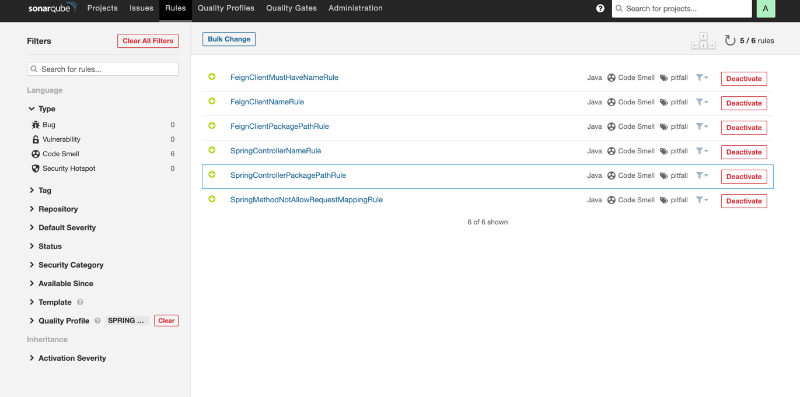
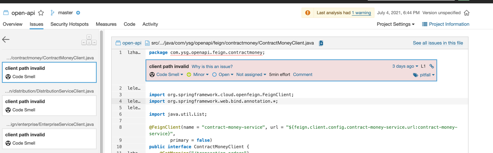
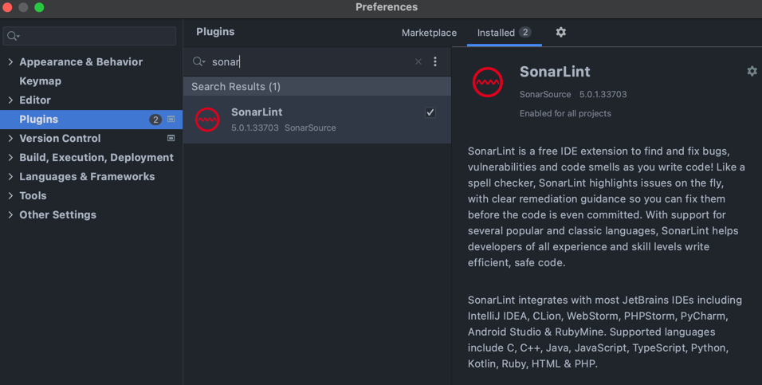
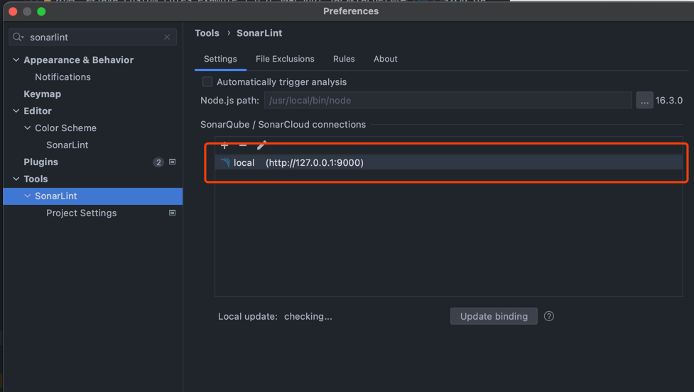
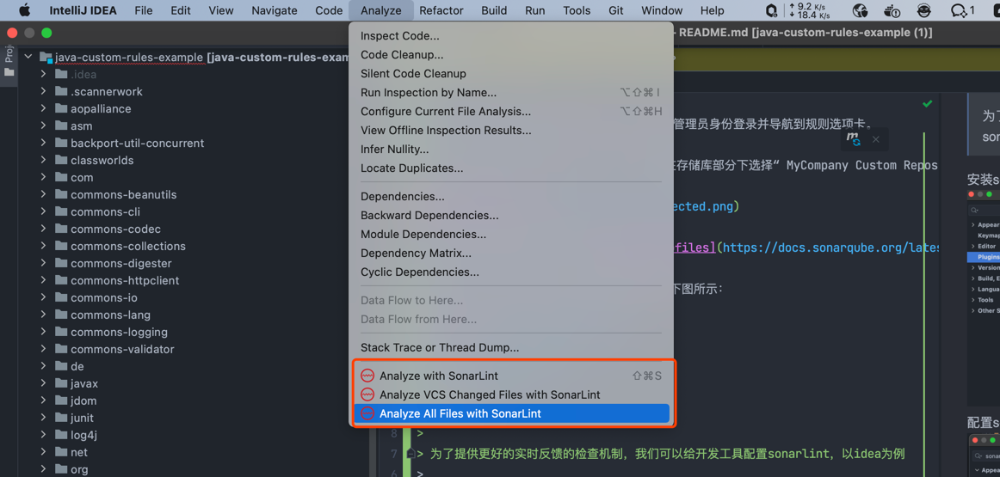

Sonar自定义规则
=======
您正在使用 SonarQube 及其 Java 分析器来分析您的项目，但没有规则允许您针对公司的某些特定需求？那么您的逻辑选择可能是实现您自己的一组自定义 Java 规则。

在我们的例子中，配置了**符合 SonarQube`8.9 LTS`要求的依赖项**

本文档提供了 SonarQube Java 分析器的自定义规则编写为spring。它提供了简单的demo去书写spring相关的代码检查规则，依赖于 SonarSource Analyzer for Java 提供的 API。

这个项目提供了以下规则示例([自定义java规则101](https://github.com/SonarSource/sonar-java/blob/master/docs/CUSTOM_RULES_101.md)):
* **@RequestMapping 写法限制:** 方法上不允许使用@RequestMapping注解
* **@FeignClient 注解必须指定name:** FeignClient 注解必须指定name
* **FeignClient 命名规则:** 被FeignClient注解修饰的类名称必须以Client结束
* **FeignClient包路径限制:** 被FeignClient注解修饰的类必须放在client的子包下 
* **SpringController命名限制:** 被@Controller或@RestController注解修饰的类名称必须以Controller结尾 
* **SpringController包路径限制:** 被@Controller或@RestController注解修饰的类必须放在controller的子包下

## 目录

* [部署开发好的插件](#部署开发好的插件)
* [本地idea配置sonarlint](#本地idea配置sonarlint)
* [gradle集成sonar](#gradle集成sonar)
* [参考](#参考)

## 部署开发好的插件
>
> **先决条件**
>
> 对于本章，您将需要一个 SonarQube 的本地实例。如果您的机器上没有安装 SonarQube 平台，现在是时候从这里下载其最新版本了！ [HERE](https://www.sonarqube.org/downloads/)!
>
首先使用 maven 构建项目。请注意，这里我们使用的是pom针对 SonarQube 8.9LTS的自包含文件
```
$ pwd
/home/gandalf/workspace/sonar-java/docs/java-custom-rules-example
  
$ mvn clean install 
[INFO] Scanning for projects...
[INFO]                                                                        
[INFO] ------------------------------------------------------------------------
[INFO] Building SonarQube Java :: Documentation :: Custom Rules Example 1.0.0-SNAPSHOT
[INFO] ------------------------------------------------------------------------
  
...
 
[INFO] ------------------------------------------------------------------------
[INFO] BUILD SUCCESS
[INFO] ------------------------------------------------------------------------
[INFO] Total time: 8.762 s
[INFO] Finished at: 2021-03-02T12:17:28+01:00
[INFO] ------------------------------------------------------------------------
```
然后，将java-custom-rules-example-1.0.0-SNAPSHOT.jar从target项目文件夹中获取 jar 文件，并将其移动到您的 SonarQube 实例的扩展文件夹中，该文件夹将位于$SONAR_HOME/extensions/plugins.

现在，（重新）启动您的 SonarQube 实例，以管理员身份登录并导航到规则选项卡。

从那里，在语言部分下，选择“ Java ”，然后在存储库部分下选择“ MyCompany Custom Repository ”。您的规则现在应该可见（与所有其他示例规则一起）。



一旦激活（不确定如何？请参阅 [quality-profiles](https://docs.sonarqube.org/latest/instance-administration/quality-profiles/) ），剩下的唯一步骤就是分析您的项目之一！

当触发了我们自定义的规则时，将引发问题，如下图所示：



## 本地idea配置sonarlint
>
> **背景**
>
> 为了提供更好的实时反馈的检查机制，我们可以给开发工具配置sonarlint，以idea为例
>
安装sonarlint插件

配置sonarlint,使其链接到远端sonar,以便于加载我们自定义的rule

运行sonarlint


## gradle集成sonar
>
> **背景**
>
> 通过常规 Gradle 任务执行 SonarQube 分析的能力使其在 Gradle 可用的任何地方（开发人员构建、CI 服务器等）都可用，而无需手动下载、设置和维护 SonarQube Runner 安装。Gradle 构建已经拥有 SonarQube 成功分析项目所需的大部分信息。通过根据该信息预先配置分析，大大减少了手动配置的需要。
>
[gradle集成sonar](https://sonarqube.inria.fr/sonarqube/documentation/analysis/scan/sonarscanner-for-gradle/)

##参考
* [自定义java规则101](https://github.com/SonarSource/sonar-java/blob/master/docs/CUSTOM_RULES_101.md)
* [Java代码文档解析](https://docs.sonarqube.org/latest/analysis/languages/java/)
* [SonarQube 平台](http://www.sonarqube.org/)
* [Java Github 存储库的 SonarSource 代码质量和安全性](https://github.com/SonarSource/sonar-java)
* [SonarQube Java 自定义规则示例](https://github.com/SonarSource/sonar-java/tree/master/docs/java-custom-rules-example)
